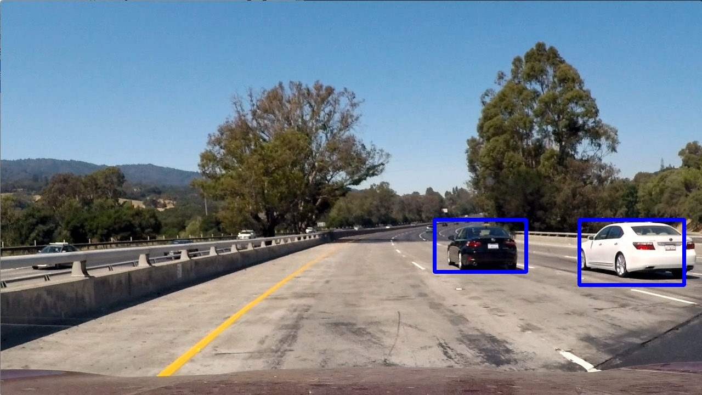
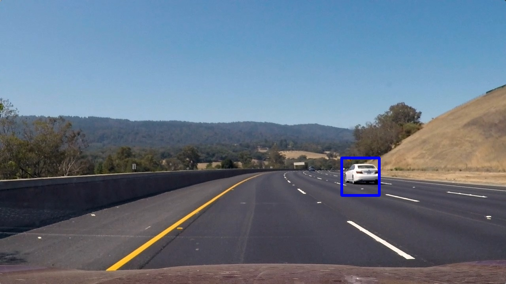
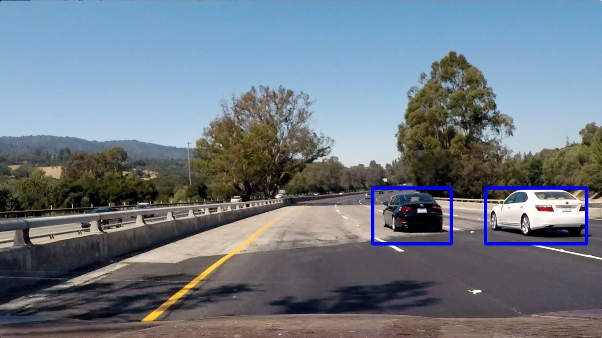
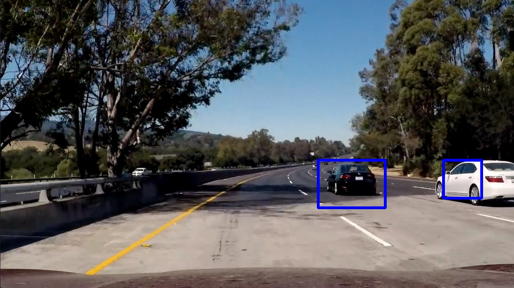
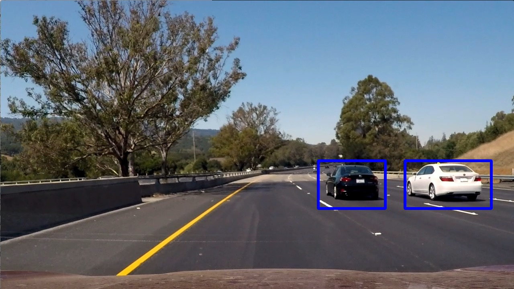

## Vehicle Tracking project by Vlad Spreys

## [Rubric](https://review.udacity.com/#!/rubrics/513/view) Points
###Here I will consider the rubric points individually and describe how I addressed each point in my implementation.  

---
###Writeup / README

####1. Provide a Writeup / README that includes all the rubric points and how you addressed each one.  You can submit your writeup as markdown or pdf.  [Here](https://github.com/udacity/CarND-Vehicle-Detection/blob/master/writeup_template.md) is a template writeup for this project you can use as a guide and a starting point.  

This file is my write up.

###Histogram of Oriented Gradients (HOG)

####1. Explain how (and identify where in your code) you extracted HOG features from the training images.

I have used two aproaches to extract the hog features and they are slightly different during the training and during the image search.

Durng the training I extract the HOG features from the whole image. The code is located in the `get_hog_features` method of my [Jupyter book](code.ipynb).

However, doing the same during the image processing would take too long as there are too many sliding windows and there would be too much processing power wasted. So, instead, I get the hog features from the whole image before I run the sliding windows. The code is available inside of my `find_cars` method of my notebook. Here is the relevant part:

```python
# Compute individual channel HOG features for the entire image
hog1 = get_hog_features(ch1, orient, pix_per_cell, cell_per_block, feature_vec=False)
hog2 = get_hog_features(ch2, orient, pix_per_cell, cell_per_block, feature_vec=False)
hog3 = get_hog_features(ch3, orient, pix_per_cell, cell_per_block, feature_vec=False)
```

####2. Explain how you settled on your final choice of HOG parameters.

I have tried various parameters during the training of my network and observed the change in accuracy. I ended up using the parameters which gave me the best accuracy despite the loss in computation speed.

####3. Describe how (and identify where in your code) you trained a classifier using your selected HOG features (and color features if you used them).

Please refer to the "Training" section of my [Jupyter book](code.ipynb). I have used `SVC` classifier with `Linear` kernel and I have configured it to output predictions instead of classifications. Outputing predictions helped me to avoid false positive results as I only consider the output to be a vehicle when confidence of the classifier is higher 95%.

Here is the relevant code from my book for training:

```python
svc = SVC(kernel='linear' , probability = True)
t=time.time()
svc.fit(X_train, y_train)
t2 = time.time()

print('Using spatial binning of:',spatial,'and', histbin,'histogram bins')
print('Feature vector length:', len(X_train[0]))
print(round(t2-t, 2), 'Seconds to train SVC...')
print('Test Accuracy of SVC = ', round(svc.score(X_test, y_test), 4))
```

And prediction:

```python
test_prediction = svc.predict_proba(test_features)
if test_prediction[0][1] > 0.95:
	#This is a car
```

Accuracy of my classifier on the test set is 98.96%

###Sliding Window Search

####1. Describe how (and identify where in your code) you implemented a sliding window search.  How did you decide what scales to search and how much to overlap windows?

I decided to search random window positions at random scales all over the image and came up with this (ok just kidding I didn't actually ;):

![alt text][image3]

####2. Show some examples of test images to demonstrate how your pipeline is working.  What did you do to optimize the performance of your classifier?

Ultimately I searched on two scales using YCrCb 3-channel HOG features plus spatially binned color and histograms of color in the feature vector, which provided a nice result.  Here are some example images:

Some example of my pipeline:








<br>
---
### Video Implementation

####1. Provide a link to your final video output.  Your pipeline should perform reasonably well on the entire project video (somewhat wobbly or unstable bounding boxes are ok as long as you are identifying the vehicles most of the time with minimal false positives.)
Here's a [link to my video result](./project_video.mp4)


####2. Describe how (and identify where in your code) you implemented some kind of filter for false positives and some method for combining overlapping bounding boxes.

I recorded the positions of positive detections in each frame of the video.  From the positive detections I created a heatmap and then thresholded that map to identify vehicle positions.  I then used `scipy.ndimage.measurements.label()` to identify individual blobs in the heatmap.  I then assumed each blob corresponded to a vehicle.  I constructed bounding boxes to cover the area of each blob detected.  

Here's an example result showing the heatmap from a series of frames of video, the result of `scipy.ndimage.measurements.label()` and the bounding boxes then overlaid on the last frame of video:

### Here are six frames and their corresponding heatmaps:

![alt text][image5]

### Here is the output of `scipy.ndimage.measurements.label()` on the integrated heatmap from all six frames:
![alt text][image6]

### Here the resulting bounding boxes are drawn onto the last frame in the series:
![alt text][image7]


---

###Discussion

####1. Briefly discuss any problems / issues you faced in your implementation of this project.  Where will your pipeline likely fail?  What could you do to make it more robust?

Here I'll talk about the approach I took, what techniques I used, what worked and why, where the pipeline might fail and how I might improve it if I were going to pursue this project further.  

